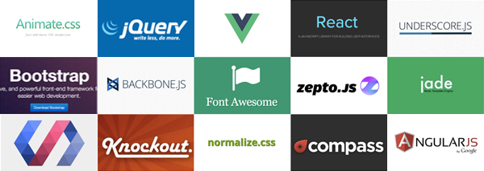
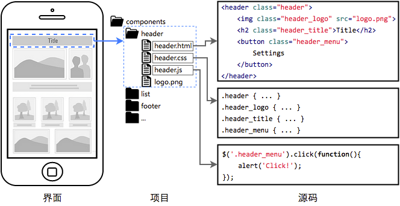
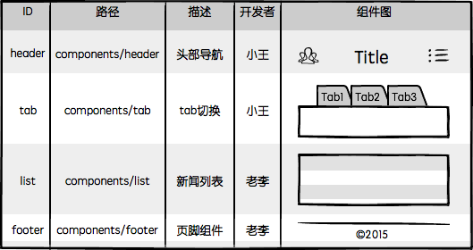
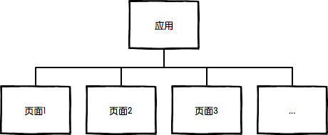
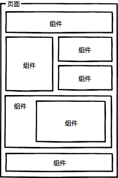
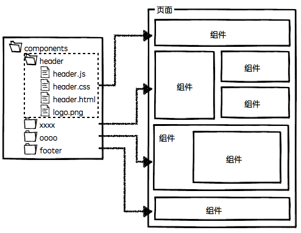
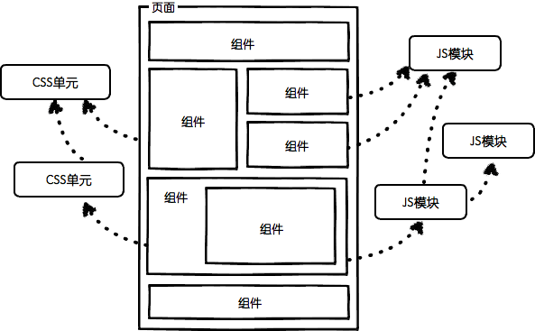
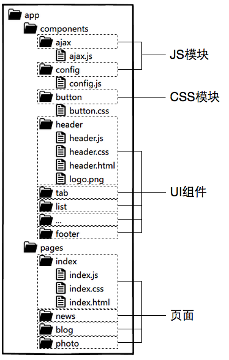
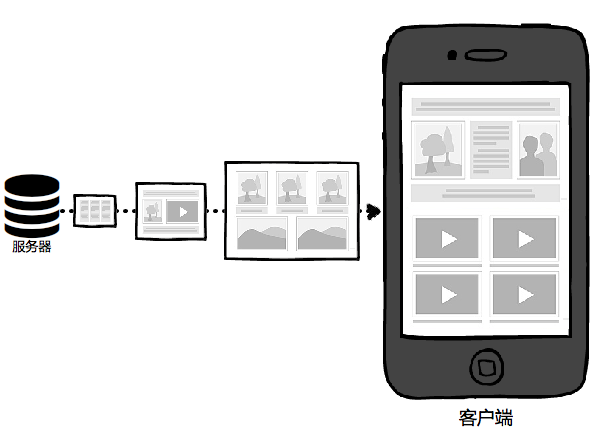

# 前端工程——开发篇

> 喂喂喂，那个切图的，把页面写好就发给研发工程师套模板吧。

你好，切图仔。

不知道你的团队如何定义前端开发，据我所知，时至今日仍然有很多团队会把前端开发归类为产品或者设计岗位，虽然身份之争多少有些无谓，但我对这种偏见还是心存芥蒂，酝酿了许久，决定写一篇文章，从工程的角度系统的介绍一下我对前端，尤其是Web前端的理解。

只要我们还把自己的工作看作为一项软件开发活动，那么我相信你读了下面的内容也会一定有所共鸣。

## 前端，是一种GUI软件

现如今前端应用可谓包罗万象，涉猎极广，有各种五花八门的产品形态，什么高大上的基础库/框架，拽炫酷的宣传页面，还有屌炸天的小游戏……林林总总中，有一类极具商业价值的产品，它是一种功能丰富的GUI软件，由许多界面（页面）组成，为用户提供了完整的产品体验，它可能是新闻聚合网站，可能是在线购物平台，可能是社交网络，可能是金融信贷应用，可能是音乐互动社区，也可能是视频上传与分享平台……

> 从本质上讲，所有Web应用都是一种运行在网页浏览器中的软件，这些软件的图形用户界面（Graphical User Interface，简称GUI）即为前端。

现代Web应用功能丰富，有着多种界面状态，交互体验精致细腻，其前端界面的体量已颇具规模，工程量不亚于一般的传统GUI软件：


尽管Web应用的复杂程度与日俱增，用户对于前端界面也提出了更高更快的要求，但仍然没有多少前端开发者会从软件工程的角度去思考前端开发，日复一日，刀耕火种。历史悠久的前端开发，始终像是放养的野孩子，原始如斯，不免让人慨叹！

## 前端工程的三个阶段

为了提升前端的开发效率和运行性能，前端团队的工程建设大致会经历三个阶段：

### 第一阶段：库/框架选型



前端工程的第一项任务就是根据项目特征进行技术选型，基础库或框架可以为项目节省许多工程量这点毋庸置疑。

技术选型一般不包括封装好的可复用组件库选型，因为前端项目通常都具有极强的个性化定制需求以及代码最小化精简需求，这两项要求对组件复用性带来了极大的挑战，所以除了某些类型的前端项目之外——比如xx后台管理系统——前端组件的复用性现阶段来说基本是一个伪命题。

### 第二阶段：简单构建优化


光解决开发效率还不够，必须要兼顾运行性能。前端工程进行到第二阶段会选型一种构建工具，对代码进行压缩，校验，之后再以页面为单位进行资源合并。

前端开发工程化程度之低，我之前在百度工作时是没有多少概念的，直到离开大公司的温室，去到业界与更多的团队交流才发现，能做到这个阶段在业界来说已然属于“具备较高工程化程度”的团队了，查看网上形形色色的网页源代码，能做到最基本的JS/CSS压缩的Web应用已然跨入标准互联网公司行列，不难理解为什么很多前端团队对于前端工程构建的认知还仅停留在“压缩、校验、合并”这种程度。

### 第三阶段：JS/CSS模块化开发


分而治之是软件工程中的重要思想，是复杂系统开发和维护的基石，这点放在前端开发中同样适用。在解决了基本开发效率运行效率问题之后，前端团队开始思考维护效率，模块化是目前前端最好的分治手段。

> 很多人觉得模块化开发的工程意义是复用，我不太认可这种看法，在我看来，模块化开发的最大价值其实是分治，是分治，分治！（重说三）。

业界目前常用的JS模块化开发方式就是基于requirejs/seajs的模块化方案，CSS模块化开发基本是在less/scss/sass/stylus等预处理器的import/mixin特性支持下实现的。

虽然这些技术由来已久，在如今这个“言必及React”的时代略显落伍，但想想业界的绝大多数团队的工程化落后程度，放眼望去，毫不夸张的说，能达到第三阶段的前端团队已属于高端行列，基本具备了开发维护一般规模Web应用的能力。

然而，做到这些就够了么？Naive！

## 第四阶段

> 前端是一种技术问题较少、工程问题较多的软件开发领域。

当我们要开发一款完整的Web应用时，前端将面临更多的工程问题，比如：

* 大体量：多功能、多页面、多状态、多系统；
* 大规模：多人甚至多团队合作开发；
* 高性能：CDN部署、[缓存控制](https://developers.google.com/speed/docs/insights/LeverageBrowserCaching)、[文件指纹](https://developers.google.com/speed/docs/insights/LeverageBrowserCaching)、缓存复用、请求合并、按需加载、同步/异步加载、移动端[首屏CSS内嵌](https://developers.google.com/speed/docs/insights/mobile)、HTTP 2.0服务端[资源推送](http://chimera.labs.oreilly.com/books/1230000000545/ch12.html#HTTP2_PUSH)。

> 扩展阅读：[大公司里怎样开发和部署前端代码？](https://github.com/fouber/blog/issues/6)

这些无疑是一系列严肃的系统工程问题。

前面讲的三个阶段虽然相比曾经“茹毛饮血”的时代进步不少，但用于支撑第四阶段的多人合作开发以及精细的性能优化似乎还欠缺点什么。

到底，缺什么呢？

## 银弹

读过《[人月神话](http://book.douban.com/subject/2230248/)》的人应该都听说过，软件工程 [没有银弹](http://baike.baidu.com/view/277972.htm)。没错，前端开发同样没有银弹，可是现在是连™铅弹都没有的年月！（刚有了BB弹，摔）

前端历来以“简单”著称，在前端开发者群体中，小而美的价值观占据着主要的话语权，甚至成为了某种信仰，想与其他人交流一下工程方面的心得，得到的回应往往都是两个字：太重。

> 我想说不是这样的，工程方案也可以小而美，它的小而美是指“规则”。

找到问题的根源，用最少最简单明了的规则制定出最容易遵守最容易理解的开发规范或工具，以提升开发效率和工程质量，这同样是小而美的典范！

2011年我有幸参与到 [FIS](https://github.com/fex-team/fis) 项目中，与百度众多大中型项目的前端研发团队共同合作，不断探索实践前端开发的工程化解决方案，13年离开百度去往UC，面对完全不同的产品形态，不同的业务场景，不同的适配终端，甚至不同的网络环境，过往的方法论仍然能够快速落地，为多个团队的不同业务场景量身定制出合理的前端解决方案。

这些经历让我明悟了一个道理：

> 进入第四阶段，我们只需做好两件事就能大幅提升前端开发效率，并且兼顾运行性能。

### 第一件事：组件化开发

分治的确是非常重要的工程优化手段。在我看来，前端作为一种GUI软件，对于UI组件的分治开发维护有着最为迫切的需求：



如上图，这是我所信仰的前端组件化开发理念：

1. 页面上的每个独立的可视/可交互区域作为一个组件；
2. 每个组件对应一个工程目录，目录中就近维护着这个组件内部所需的各种资源；
3. 由于组件具有独立性，因此组件与组件之间可以自由组合；
4. 站点页面只不过是组件的容器，负责组合组件得到页面；
4. 当不需要某个组件，或者想要替换组件时，可以整个目录删除/替换。

> 注意，组件的HTML内容，根据业务技术选型的不同，可能是静态的HTML文件，可能是jade/handelbars/ejs等前端模板，也可以是php/jsp/smarty/velocity/ejs/swig等后端模板。

其中第二条``就近维护``是我觉得最具工程价值的地方，它为前端开发提供了很好的分治手段，因为每个开发者都清楚的知道，自己要开发或维护系统中的某个功能时，其代码必然存在于对应的组件目录中，在那个目录下能找到有关这个功能单元的全部代码，样式也好，JS也好，页面结构也好，都在那里。

基于这样的工程理念，我们很容易将系统以独立的组件为单元进行分工：



由于系统功能被分治到独立的模块或组件中，粒度比较精细，组织形式松散，开发者之间不会产生开发时序的依赖，大幅提升并行的开发效率，理论上允许随时加入新成员认领组件开发或维护工作，也更容易支持多个团队共同维护一个大型站点的开发。

结合前面提到的模块化开发，整个前端工程可以拆分为这么几种开发概念：

| 名称 | 描述 | 举例 |
|-----|-----|-----|
| JS模块 |独立的算法和数据单元|浏览器环境检测(detect)，网络请求(ajax)，应用配置(config)，DOM操作(dom)，工具函数(utils)|
| CSS模块 |独立的功能性样式单元|栅格系统(grid)，字体图标(icon-fonts)，动画样式(animate)|
| UI组件 |独立的可视/可交互功能单元|页头(header)，页尾(footer)，导航栏(nav)，搜索框(search)|
| 页面 |前端这种GUI软件的界面状态，是UI组件的容器|首页(index)，列表页(list)，用户管理(user)|
| 应用 |整个项目或整个站点被称之为应用，由多个页面组成| |

基于这样的理念，我眼中的前端开发就成了这个样子：

|描述|图示|
|----|----|
|多个页面共同组成了整个前端应<br/>用，每个页面代表应用的一种界面状态||
|组件与组件彼此组合，得到一个<br/>个完整的页面，页面只是组件的容器||
|一个组件一个目录，内部资源就<br/>近维护，高内聚，低耦合||
|组件与组件可以嵌套组合，组件<br/>的JS会依赖其他JS模块，组件<br/>的CSS也会依赖其他CSS单元||

综合上面的描述，对于一般中小规模的项目，大致规划出项目的目录结构为：



如果项目规模较大，涉及多个团队协作，还可以将具有相关业务功能的页面组织在一起，形成一个子系统，进一步将整个站点拆分出多个子系统来分配给不同团队维护，后面我会单开文章详细介绍这种情况。

以上架构设计历经诸多前端团队的验证，收获了不错的口碑，是行之有效的前端工程分治方案。

> 吐槽：我本人非常反对某些前端团队将前端开发划分为“JS开发”和“页面重构”两种岗位，更倾向于组件粒度的开发理念，对GUI软件开发的分工规划应该以功能为单位，而不是开发语言；对开发者的技术要求也应该是掌握完整的端内技术。

### 第二件事：“智能”静态资源加载框架




无论在HTTP1.x还是HTTP2.0时代，无论在ES6亦或者ES6时代，无论是seajs/requirejs亦或者ES7 modules

## 架构

你好，工程师。

1. Web前端应用 = GUI软件
    - library/framework
    - 混合型客户端应用
    - Web应用
2. 有别于传统GUI
    1. 远程部署，运行时增量安装
    2. 三种语言，仅JS具备逻辑运算能力
3. 前端开发三个阶段
    1. 库/框架
    2. 压缩
    3. JS模块化、css模块化开发
4. 第四阶段
    * 真正做一款GUI软件
    * 大体量 = 多页面、多功能、多状态、多系统
    * 高性能 = CDN部署、缓存控制、缓存复用、请求合并、按需加载、同步/异步加载、移动端首屏优化、HTTP 2.0服务端推送
    * 大规模 = 多人开发
5. 答案
    * 模块化/组件化开发
    * 静态资源管理
6. FIS
    * 历史
    * 三种能力
    * 资源关系表
    * 加载器
7. 玩法
    * SPA
    * MPA
    * ATF
    * quickling/pjax
    * HTTP 2.0
8. 尴尬


> React的降临算是给前端工程带来一线希望么？
> 
> 抛去对伟大的Facebook的狂热信仰，我觉得它确实降低了某一较大类别的前端工程成本，但还不够普适，至少到目前为止，前端还有很大一部分应用场景不能完美的以React理念进行开发。


# 写在新版 [FIS](https://github.com/fex-team/fis3) 发布之前（上）

下一代FIS的开发工作已基本完成，相关文档还在完善中，这个版本我虽然没有亲自参与开发，但也针对新版本的改进给出了许多 [意见](https://github.com/fex-team/fis/issues/312) ，FIS是我入行以来投入最大的项目，整个研发历程让我对前端有了许多感悟，形成自己独特的工程理念。

由于之前没有太过重视对文档梳理工作，FIS项目的真正价值没有得到充分展示，使其蒙受不少误解，这是一件非常遗憾的事。借着这次新版发布的机会我决定写一篇长文，跟大家聊聊Web前端，聊聊前端开发。

> 放心，这篇文章绝不是毫无营养的软文！我从业至今已有5年工作经验（算上加班应该是7年），混到今天不容易，因为我懂得太少，而且只会一式“绝招”，这里想分享的正是这招式的“口诀心法”，FIS只不过是为这门绝招量身打造的一件趁手的兵器而已。

这事说来话长，但我尽量长话短说。

## 愿景

> 天下武功无坚不摧，唯快不破

相信所有开发者应该都有两个关于速度的追求：

* 开发效率高
* 运行效率高

对于前端来说，只要我们还把自己的工作看待为一种软件开发活动，相信也会有着相同的愿景，对开发效率和运行效率的极致追求正是我们实践前端工程的原动力。

然而现实并不那么完美，运行性能高的代码往往不方便维护，而开发效率高的方式也大多无法保证运行效率。Web前端相比其他软件开发来说，编程方式更加松散，编程语言更加混杂，而且运行时程序资源还是部署在远程服务器，而非用户本地，这些天生的硬伤无不给开发者对于速度的追求带来了巨大的挑战。

面对困难，我们必须亮剑。

## 三个阶段

在提升开发效率和运行效率的道路上，前端开发者一直没有停下脚步，一般前端团队的工程发展大致会经历三个阶段：

* 第一阶段：利用基础库/框架实现能满足产品需求的Web应用（提升开发效率）
* 第二阶段：利用自动化工具对js、css、图片进行压缩，以页面为单位进行简单的资源合并（提升运行效率）
* 第三阶段：利用模块化框架解决JS方面的按需加载和分治问题，引入预编译语言，资源部署CDN（提升开发和运行效率）

第一阶段注重开发效率，主要的目标是满足基本的业务要求，实现产品功能；到第二阶段开始注重运行性能，会引入一些自动化的工具进行初步的资源精简优化；第三阶段则通过引入预编译语言（主要是CSS预编译）和JS模块化框架对代码进行拆分，提高开发效率，降低维护成本，资源部署CDN则优化了网络性能，提升运行效率。

前端团队的工程化水平发展到第三阶段就完事了么？Naive！

## Web前端的本质

Web真是包罗万象，有各种五花八门的产品形态。有人做高端的基础库/框架，有人做炫酷的宣传页面，要实现这些小而美的前端产品或许只需以上三个阶段的优化即可。

但Web中还有一类产品，它是一种功能丰富的GUI软件，由许多功能各异的界面（页面）组成，为用户提供了完整的产品体验，是一种基于Web的应用软件。它可能是新闻聚合，可能是在线购物，可能是社交网络，可能是金融信贷，可能是音乐互动，可能是游戏平台，也可能是视频上传与分享……

从本质上讲，所有Web应用都是一种运行在网页浏览器中的软件，而这种软件的图形用户界面（GUI）即为Web前端。

然而选择Web前端构建软件的图形界面与传统应用会有一点差别，因为前端的所有程序资源都是远程部署的，我们需要在用户使用的过程中、在程序运行时，以增量的方式逐步将界面程序资源“安装”到用户的设备上，远程部署的收益是Web应用“免安装”和“免升级”，但代价就是响应速度受限于网络。

> Web前端是一种远程部署，运行时增量下载安装的GUI软件。

复杂的Web应用其全部前端程序资源也是个不小的体量，我们不能让用户打开页面后等待下载完所有前端程序资源再运行，“增量下载”才是Web前端流畅体验的关键。

```
复杂的Web应用静态资源体量有多少呢？在2010年的Velocity China大会上
来自Facebook的David Wei博士分享了一些关于Facebook的项目数据：

    1. Facebook整站有10000+个静态资源；
    2. 每个静态资源都有可能被翻译成超过100种语言版本；
    3. 每种资源又会针对浏览器生成3种不同的版本；
    4. 要针对不同带宽的用户做5种不同的打包方法；
    5. 有3、4个不同的用户组，用于小批次体验新的产品功能；
    6. 还要考虑不同的送达方法，可以直接送达，或者通过iframe加载；
    7. 静态资源的压缩和非压缩状态可切换，用于调试和定位线上问题

这是一个状态爆炸的问题，将所有状态乘起来，整个网站的资源组合方式会达到几
百万种之多（去重之后统计大概有300万种组合方式）。
```

前端使用三种“玩具”般的开发语言，组织形式毫无规约，相当松散；所有程序资源又要求远程部署，运行时增量下载。这两点特殊性使得我们在开发Web前端项目时相比传统GUI软件开发会遭遇更多多的工程问题，如何组织研发团队高效地开发一款界面繁多、功能复杂的Web前端应用，同时保障最终产品性能优异、体验流畅，这必然是严肃的工程问题。

> 在我看来，前端是一个技术问题极少，工程问题极多的软件开发领域。

之前的三个阶段没能更深入地解决Web前端开发与性能优化的工程问题，当我们要开发一款功能完善的Web应用时，前端工程必将进入第四阶段。

## 第四阶段


为一款功能完善的Web应用开发浏览器中的图形用户界面，相信这才是Web前端最主要的应用场景，

开发效率：彻底的组件化/模块化开发，
运行效率：高级性能优化方案的应用

1. 按需并行加载、同步/异步加载
2. url中添加文件指纹、非覆盖式发布
3. webapp资源组合、localstorage缓存
4. 基于统计的打包
5. bigpipe、quickling、pagecache
6. ATF优化

解决方案：引入静态资源管理系统

开发、部署与优化三者分离


很不幸，前端最需要的就是静态资源管理，而恰恰却没有这样的设计思想

以页面为单位的分治不合适，粒度太大，有功能重叠

* 组件化开发与维护
* 完整的js/css按需加载与请求合并
* 资源的懒加载、预加载
* 线上代码可以随时切换压缩/非压缩、合并/非合并状态
* 单页面的js/css资源组合问题
* 基于内容摘要的非覆盖式发布
* 从用户访问行为和版本升级迭代的角度调整打包策略，提升页面间缓存利用率，降低缓存失效率
* 高级性能优化方案：bigpipe、quickling、pagecache
* 移动端首屏优化

## 前世今生

## 一式神通

